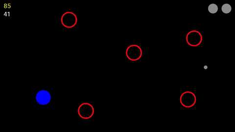

# Finger Tag

Copyright (c) 2017 [Finn Ellis](mailto:relsqui@chiliahedron.com).

Finger Tag is a multiplayer avoid game for Android. It's also my learning project for both Android and Java, so consider its future volatile! That said, review comments are welcome.

## What's it look like?

Like this, except less grainy:

You can also watch the [gameplay video](https://youtu.be/SI5gksmGQAE) that gif came from. Note that this doesn't show off the multiplayer feature because I'm not coordinated enough to record that by myself.

## Can I play it?

If you're OK installing an APK from somewhere other than the play store, sure! There's usually a recent-ish build [here](http://peeron.chiliahedron.com/android/finger-tag.apk). (If you haven't installed a loose APK before, just open that file on your Android phone and it'll walk you through it.)

## Are you going to publish it?

Maybe eventually. There are a number of things I'd want to add first.

## I have an opinion/idea/suggestion/question.

Feel free to [email me](mailto:relsqui@chiliahedron.com) or add it to the [issue tracker](https://github.com/relsqui/finger-tag/issues).
